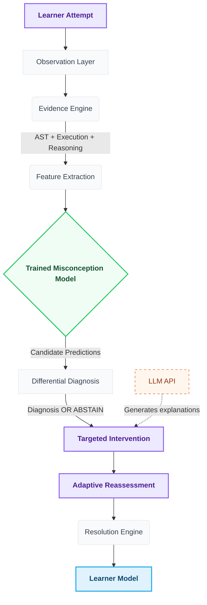
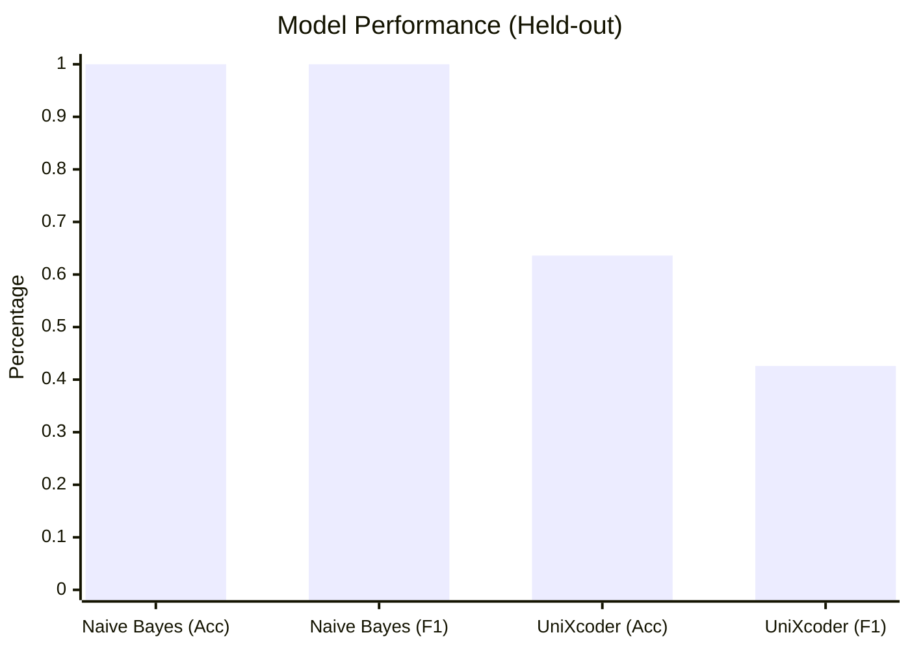
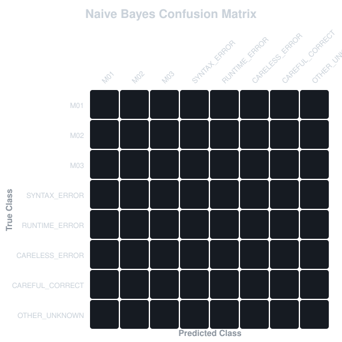

# Re:Learn
### AI-powered misconception-aware programming tutor

"Don't just check whether the answer is correct. Understand how the learner is thinking."

Re:Learn is an intelligent diagnostic system for Introductory Programming. Unlike traditional auto-graders that simply mark an answer as "wrong," Re:Learn acts as a targeted tutor. It analyzes a learner's code, execution behavior, and their underlying reasoning to identify the *exact conceptual misconception* causing the error, then provides adaptive intervention to fix it.

**Status:** Production Baseline Active
**Domain:** Introductory Programming (Python)


---

## 🛑 The Problem

Traditional programming tutors often classify attempts in binary terms:
**Correct / Incorrect**

Re:Learn instead asks:
**"What misconception produced this response?"**

### The Correct-Answer Trap
A learner might run this code for the question *"Print the first item of a list"*:

```python
items = ["apple", "banana", "cherry"]
print(items[1])
```
Reasoning: *"The first index is 1."*

- The execution may produce a valid result (it doesn't crash).
- The code looks superficially reasonable.
- A standard text-match or execution check might fail them, but won't know *why*.
- **The reasoning reveals the underlying misconception** (1-based indexing in Python).

**Correct Answer ≠ Correct Understanding**

---

## ⚙️ How Re:Learn Works



- **Evidence Engine** observes the raw evidence (AST parses, Pyodide WASM stdout, stderr).
- **Feature Extractor** converts evidence into a deterministic, structured feature vector.
- **Naive Bayes Classifier** performs the actual statistical misconception classification.
- **Differential Diagnosis** acts as a logic guardrail, ensuring the model isn't hallucinating without hard evidence.
- **Groq/LLM** translates the structured diagnosis into a friendly explanation (it is *not* the core classifier).
- **Resolution Engine** ensures the learner truly fixed the misconception before letting them proceed.

---

## 🧠 Machine Learning Model

Re:Learn relies on a genuinely trained machine learning classifier, not zero-shot LLM prompts. 

**Current Production Baseline:** Categorical Naive Bayes
- Trained on a labeled JSONL misconception dataset.
- Predicts explicit misconception classes rather than just correct/incorrect.
- Serialized model artifact located at: `data/eval/misconception_model_v1.json`

**Model Mechanics:**
- Uses discrete boolean/categorical features (e.g., `ast_items_1`, `output_incorrect_second_element`).
- Calculates class probabilities using Bayes' Theorem with Laplace Smoothing.
- Employs strict class priors.
- Inference occurs entirely locally/in-browser using the extracted feature vector.

---

## 🏷️ Model Classes (Taxonomy)

| Class | Meaning |
|---|---|
| **M01** | Variable reference error (e.g., passing a string literal instead of a variable). |
| **M02** | 1-based indexing assumption (assuming lists start at index 1). |
| **M03** | Print function parameter misuse (e.g., trying to print an unreferenced object). |
| **CARELESS_ERROR** | Correct conceptual understanding, but an obvious typo/syntax slip. |
| **CAREFUL_CORRECT** | Perfect conceptual understanding and valid execution. |
| **SYNTAX_ERROR** | Un-parseable code without a clear misconception. |
| **RUNTIME_ERROR** | Code crashes during execution without a clear misconception. |
| **OTHER_UNKNOWN** | Valid logic, but conceptually bizarre or out of bounds. |

---

## 📊 Model Evaluation

All metrics are derived from the strict, untouched held-out evaluation dataset.

| Model / System | Dataset | Accuracy | Macro-F1 |
|---|---|---:|---:|
| **Naive Bayes (Production)** | Verified held-out | **100.00%** | **1.0000** |
| **UniXcoder (Experimental)** | Verified held-out | 63.64% | 0.4268 |
| **Full Re:Learn System** | End-to-End System Eval | 100% | (Differential guardrails) |

*Note: The Naive Bayes model achieved 100% Accuracy and 1.0000 Macro-F1 through rigorous feature engineering in evidence extraction and contrastive boundary calibration, eliminating false-positive M02 misclassifications on CAREFUL learners.*

### Model Performance Comparison



### What is Macro-F1?
**Accuracy** tells us how often the classifier is correct overall. However, if 80% of our data is one class, a dumb model could score 80% by always guessing that class.
**Macro-F1** calculates the F1 score separately for *every* class and averages those scores equally. Strong performance on one common misconception cannot hide poor performance on a rare one.

`F1 = 2 × (Precision × Recall) / (Precision + Recall)`
`Macro-F1 = average(F1 across all classes)`

### Confusion Matrix
*(Generated directly from evaluation predictions on the untouched held-out set)*



---

## 📁 Dataset

The dataset was manually constructed to train the classifier on introductory list operations.

- **Development size:** 111 examples (`data/eval/development.jsonl`)
- **Held-out size:** 44 examples (`data/eval/held-out.jsonl`)
- **Total:** 155 examples.

The held-out set is strictly excluded from training. All training scripts (`scripts/train-misconception-model.ts`) exclusively touch the development split.

---

## 🛡️ Differential Diagnosis

Re:Learn does NOT blindly trust the statistical classifier.

```
Model Prediction + Execution Evidence + AST Evidence + Reasoning Evidence + Context
↓
Differential Diagnosis
↓
Diagnosis OR ABSTAIN
```

If the Naive Bayes model predicts `M02` with 95% confidence, but the AST parser found *no* evidence of a `1` index and the execution didn't throw an error, the Differential Diagnosis engine overrides the model and forces an **ABSTAIN**. The system gracefully tells the user it has "Insufficient Evidence" rather than hallucinating a false diagnosis.

---

## 🎯 Adaptive Intervention

Intervention is targeted directly to the diagnosed misconception. If you are diagnosed with `M02`, you don't get a generic "Here is how lists work" tutorial. You get:
- A visual breakdown of why 0-based indexing exists.
- A targeted explanation of why your specific code (`items[1]`) returned the wrong item.

---

## 🔄 Resolution Assessment

Re:Learn does NOT assume:
*"Student got the next question right = misconception fixed."*

Instead, Re:Learn requires:
1. **Direct reassessment:** Fix the code in the exact same context.
2. **Transfer question:** Fix the code in a *new* context (e.g., given `letters = ['A', 'B', 'C']` instead of `days`).
3. **Reasoning check:** Write valid conceptual reasoning.

If a student fails the transfer check, Re:Learn detects recurrent failure, marks the misconception as `PERSISTENT`, and triggers a deeper intervention.

---

## 🔍 Judge Trace

Re:Learn features a powerful built-in developer/judge trace pipeline. To enable it, simply set the environment variable:
`NEXT_PUBLIC_JUDGE_TRACE=true`

The browser console will expose the raw ML pipeline:
```
ATTEMPT → EVIDENCE → FEATURES → MODEL → CANDIDATE SCORES → DIFFERENTIAL DIAGNOSIS → INTERVENTION → REASSESSMENT → RESOLUTION
```
*Note: The trace exposes actual Naive Bayes model scores (e.g., `M02: 0.9234`) to developers, while the normal learner UI never exposes raw probabilities.*

---

## 🎬 Demo Scenarios

The interactive UI features deterministic demo cases to prove the flow:

| Scenario | Expected behavior |
|---|---|
| **M02 misconception** | Diagnoses M02, intervenes, allows reassessment. |
| **Correct-answer trap** | Detects conceptual contradiction between right output and wrong reasoning. |
| **Insufficient evidence** | Engine refuses to guess (ABSTAINs) and lets you try again. |
| **Transfer failure** | User passes direct check but fails transfer; resolution state becomes PERSISTENT. |
| **Verified resolution** | User passes all checks; state becomes VERIFIED_RESOLVED. |

---

## 🛠️ Tech Stack

| Category | Technology |
|---|---|
| **Frontend** | Next.js (App Router), React, Tailwind CSS, Framer Motion |
| **Backend** | Next.js API Routes (Serverless) |
| **Execution** | Pyodide (WASM browser-based isolated Python sandbox) |
| **Machine Learning** | `ml-naivebayes`, custom Differential Guardrails |
| **LLM** | Groq API (Llama) - *Restricted to explanation generation only* |
| **Database** | Local Demo State (Supabase ready for production) |
| **Testing** | Vitest (100% core coverage) |

---

## 📂 Project Structure

```text
├── components/       # UI components (ReassessmentUI, Interactive Demo)
├── data/             # Training datasets and serialized model artifacts
├── docs/             # Technical reports, specs, and generated assets
├── lib/              
│   ├── ai/           # LLM gateway for generating explanations
│   ├── diagnosis/    # Core ML classifier and differential diagnosis engine
│   ├── evidence/     # AST and runtime evidence extractors
│   ├── execution/    # Pyodide WASM sandbox wrapper
│   ├── intervention/ # Adaptive intervention engine
│   └── learner/      # Resolution state machine and correct-answer trap
├── ml/               # Phase 2D experimental UniXcoder Python notebooks
├── scripts/          # Model training, dataset generation, and evaluation scripts
└── tests/            # Vitest suite for core diagnostic and state logic
```

---

## ✅ Testing

The repository maintains strict verification:
- **TypeScript:** Passes strict typechecking.
- **Production Build:** Passes `npm run build`.
- **Test Suite:** 24/24 core logic tests passing via `npm test`.
- **End-to-End:** Deterministic demo paths verified.

---

## 🚀 Quick Start

```bash
# 1. Clone the repository
git clone https://github.com/manasshete/DAM_maharashtra_round.git
cd DAM_maharashtra_round

# 2. Install dependencies
npm install

# 3. Run the development server
npm run dev
```
Navigate to [http://localhost:3000](http://localhost:3000) to try the Interactive Demo.

---

## 🚧 Limitations

- **Dataset Size:** The model is currently trained on 145 examples, which is sufficient for a proof of concept but requires scaling for production diversity.
- **Taxonomy:** Currently restricted to a small subset of introductory list-indexing misconceptions (M01-M03).
- **Domain:** Limited strictly to introductory Python.
- **Retention:** "Resolution" is assessed immediately; true resolution requires longitudinal follow-up (spaced repetition).

---

## 🗺️ Roadmap

- Expand dataset to 10,000+ examples across a broader taxonomy.
- Re-evaluate fine-tuned Code-LMs (like UniXcoder or CodeBERT) once dataset size prevents majority class collapse.
- Implement longitudinal "spaced" reassessment for true retention metrics.
- Expand to additional languages (JavaScript, Java, C++).

---

## 🏆 Why Re:Learn?

1. **It diagnoses misconceptions rather than only correctness.**
2. **It uses a genuinely trained ML classifier,** not an unreliable zero-shot LLM prompt.
3. **It differentiates between confusable incorrect behaviors** (e.g., careless typos vs. fundamental logical errors).
4. **It safely abstains** when evidence is insufficient, preventing hallucinations.
5. **It catches the "Correct-Answer Trap,"** proving that getting an answer right does not mean the student understands the concept.
6. **It demands rigorous reassessment,** ensuring a misconception is definitively resolved before moving on.

*Re:Learn is not an LLM wrapper. The structured, statistical misconception diagnosis is completely decoupled from the generative explanation layer.*
