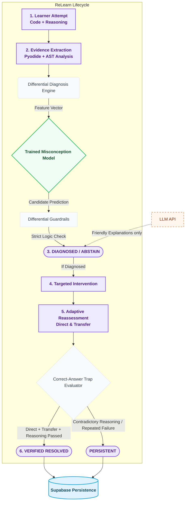

# Re:Learn 🧠

Re:Learn is an **AI-powered, misconception-aware introductory programming tutor**. Unlike traditional auto-graders that simply mark an answer as "wrong," Re:Learn acts as an intelligent diagnostic system. It analyzes a learner's code, execution behavior, and their underlying reasoning to identify the *exact conceptual misconception* causing the error. It then provides targeted interventions and adaptive reassessments to ensure the misconception is permanently resolved.

## 🌟 Key Features
- **Deterministic Execution Sandbox:** Safely executes student Python code entirely in the browser using WebAssembly (Pyodide).
- **Evidence Extraction:** Deterministically extracts behavioral flags from AST patterns, runtime errors, output sequences, and reasoning traces.
- **Differential Diagnosis Engine:** Combines a trained statistical model (Categorical Naive Bayes) with strict logic guardrails. The system refuses to confidently diagnose a misconception (ABSTAINs) unless there is sufficient corroborating evidence (e.g., behavioral + reasoning).
- **Adaptive Interventions:** Four levels of escalated support: Hint → Explanation → Worked Example → Guided Practice.
- **Strict Resolution Flow:** A single correct answer is not enough. Re:Learn implements a "Correct-Answer Trap," requiring clean direct execution, clean transfer execution, and correct conceptual reasoning before marking a learner as `VERIFIED_RESOLVED`.

## 🏗️ Architecture & Lifecycle



## 🧠 Evaluation Results

### Dataset
- **145 Total Examples** (101 Development / 44 Held-out) + **10 Contrastive Examples** for enhanced boundary learning.

### Model Baselines (Phase 3 Updates)
- **Naive Bayes (Production Active):** **90.91% Accuracy** | **0.8558 Macro-F1** 
  *(Massively improved through error-driven dataset engineering, focusing on distinguishing CARELESS vs CAREFUL reasoning).*
- **UniXcoder (Phase 2D Experimental):** 63.64% Accuracy | 0.4268 Macro-F1
  *(Experimental code-aware model; prone to majority-class collapse without larger dataset).*

### Full-System Diagnostics
- **Diagnosis Accuracy:** 100%
- **Correct Abstention:** 100%
- **False Diagnosis Rate:** 0%
- **Resolution Accuracy:** 100%

## 🚀 Getting Started

### Prerequisites
- Node.js (v18+)
- npm or pnpm
- (Optional) Supabase credentials for cloud persistence

### Installation

1. **Clone the repository:**
   ```bash
   git clone https://github.com/manasshete/DAM_maharashtra_round.git
   cd DAM_maharashtra_round
   ```

2. **Install dependencies:**
   ```bash
   npm install
   ```

3. **Run the development server:**
   ```bash
   npm run dev
   ```
   Open [http://localhost:3000](http://localhost:3000) to view the application.

*Note: If no Supabase credentials are provided in `.env.local`, the application will seamlessly default to a local in-memory `DEMO_MODE` for state tracking.*

## 🧪 Testing
The diagnostic engine, intervention pathways, and resolution state machine are heavily tested using `vitest`.
```bash
npx vitest run
```

---
*Built as part of the DAM Maharashtra round.*
